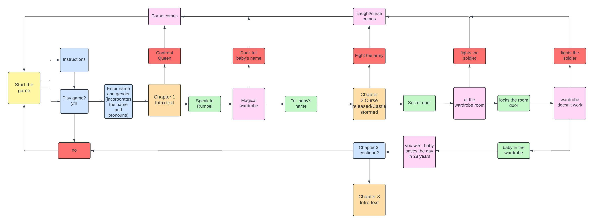
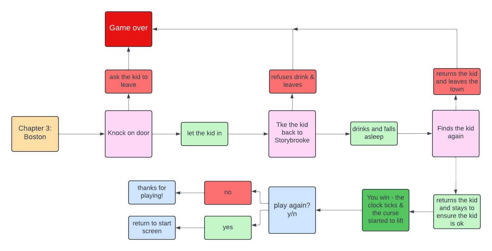

# Once Upon a Time...
(By Laura Kondrataite)

Are you a fan of fairy tales, and even more so of Disney fairytales..?

Then, you are in luck! 

Join us and relive the beginning of the popular American TV show "Once Upon A Time".  It is a text-based game that recreates the pilot episode of the show, and allows the user to play out the sequence of events by choosing multiple options. 

The game incorporates the user's data to make it more interactive and make the user part of story-telling.

The link to live gameplay can be found [here](https://once-upon-a-time-f214671524cd.herokuapp.com/).

## Table of Contents

[How to Play](#how-to-play)

[Design](#design)
- [Target Audience](#target-audience)
- [User Stories](#user-stories)
- [Flowcharts](#flowcharts)

[Features](#features)
- [Existing Features](#existing-features)
- [Features Left to Implement](#features-left-to-implement)

[Tools and Technologies](#tools-and-technologies)
- [Languages Used](#languages-used)
- [Frameworks, Libraries and Programs Used](#frameworks-libraries-and-programs-used)

[Data Model](#data-model)

[Testing](#testing)

[Deployment](#deployment)

[Credits](#credits)

## How to play

## Design
### Target Audience

The main target audience for the game is anyone aged 16 and over, who enjoys text-based adventures, and/ or is a fan of the TV Show and Disney fairytales.

### User Stories
**First Time User**

- As a first time user, I want to clearly see what the application is about.
- As a first time user, I want to be able to read instructions.
- As a first time user, I want to be able to decide whether to proceed with the game after reading instructions.

 

- As a user, I want to be able to skip the instructions and go straight to the game.
- As a user, I want to see the game customised based on my name and gender.
- As a user, I want to be able to decide to finish the game once reached a certain stage of the game.
As a user, I want to be able to proceed to the next stage of the game after the first part is finished.
- As a user, I want to return to the main screen after the game has finished.

### Flowcharts
I used [Lucidchart](https://lucid.app/) for creating logic and structure of the game. The flowchart of the project were split between two screens due to limited use of blocks per one chart.

- MVP flowchart:

- Future feature flowchart:

## Features
### Existing Features
### Features Left to Implement

[Return to Table of Contents](#table-of-contents)
## Tools and Technologies

### Languages Used

- Python language was used for creating the gameplay. 
- Markdown was used for creating the README file.

### Frameworks, Libraries and Programs Used

The following resources were used to help implement the website:
- [Lucidchart](https://lucid.app/) for creating flowchart of the game
- [GitHub](https://github.com/) for creating and storing files and folders of the website
- Git was used for version control
- VScode editor for writing the code
- [CI Python Linter](https://pep8ci.herokuapp.com/#) for checking best code practices 

 [Return to Table of Contents](#table-of-contents)

## Data model

[Return to Table of Contents](#table-of-contents)
## Testing
[testing.md](TESTING.md)

[Return to Table of Contents](#table-of-contents)
## Deployment

The live link to the game can be found [here](https://once-upon-a-time-f214671524cd.herokuapp.com/).

[Return to Table of Contents](#table-of-contents)
## Credits

Refactoring:

- I used the following discussion board for refactoring user_input() function as moving the code to a second line was raising an error:
    - https://discuss.python.org/t/struggling-with-while-loops/20865/10
- The following article has given an idea how to refactor option_choice() function:
    - https://www.freecodecamp.org/news/best-practices-for-refactoring-code/

Data Validation resources:
https://www.w3schools.com/python/python_try_except.asp
https://www.w3schools.com/python/ref_string_isalpha.asp
https://www.w3schools.com/python/ref_string_isnumeric.asp
https://docs.python.org/3/library/exceptions.html
https://docs.python.org/3/library/stdtypes.html#str.isdigit
https://stackoverflow.com/questions/16399721/making-sure-no-integers-in-a-string
https://p-kane.medium.com/input-validation-with-python-570953d5d297

Acsii resources:

discussion thread that helped to make the design print: https://stackoverflow.com/questions/23623288/print-full-ascii-art

Information on how to print ascii art: https://www.youtube.com/watch?v=arcFqEuV_XQ

Once Upon a time TV show information and some of the content borrowed from there:
https://en.wikipedia.org/wiki/Pilot_(Once_Upon_a_Time)

Dictionary iteration:
https://www.geeksforgeeks.org/python-accessing-items-in-lists-within-dictionary/
https://realpython.com/iterate-through-dictionary-python/

[Return to Table of Contents](#table-of-contents)