# Once Upon a Time...

(By Laura Kondrataite)

Are you a fan of the fairy tales, and even more so of Disney...?

Then, you are in luck! 

Join us and relive the events of the popular American TV show "Once Upon A Time". 

"Once Upon a Time..." is a text-based game that recreates the pilot episode of the show, allowing the user to play out the sequence of events by choosing from multiple scenarios. 

The game incorporates the user's data to make it more interactive and make the user part of the story-telling, as if they were the hero of the show!

The game can be accessed [here](https://once-upon-a-time-f214671524cd.herokuapp.com/).

## Table of Contents

[How to Play](#how-to-play)

[Design](#design)
- [Target Audience](#target-audience)
- [User Stories](#user-stories)
- [Flowcharts](#flowcharts)

[Features](#features)
- [Existing Features](#existing-features)
- [Features Left to Implement](#features-left-to-implement)

[Tools and Technologies](#tools-and-technologies)
- [Languages Used](#languages-used)
- [Frameworks, Libraries and Programs Used](#frameworks-libraries-and-programs-used)

[Testing](#testing)

[Deployment](#deployment)
- [Github](#github)
    - [How to Fork](#how-to-fork)
    - [How to Clone](#how-to-clone)
- [Heroku](#heroku)

[Credits](#credits)
- [Content](#content)
- [Ascii art](#ascii-art)
- [Refactoring](#refactoring)
- [General resources](#general-resources)
- [Acknowledgments](#acknowledgments)
- [Code inspiration](#code-inspiration)

## How to play

- Once the application is loaded, the Welcome screen is displayed. Choose whether to read the instructions or go straight to the gameplay.
- If chosen to proceed to the game, enter appropriate data (name and gender) to move forward. The data will customise the gameplay.
- When prompted, select appropriate answers to progress.
    - These are questions that require to type in either yes/no or '1'/'2' into the provided fields.
- If the choice is incorrect, the main screen load and the game restarts.
- If you are successful, choose whether to progress further or finish playing the game. 

[Return to Table of Contents](#table-of-contents)

## Design
### Target Audience

The main target audience for the game is anyone aged 16 and over, who enjoys text-based adventures, and/ or is a fan of the TV Show and Disney fairytales.

### User Stories
**First Time User**

- As a first time user, I want to clearly see what the application is about.
- As a first time user, I want to be able to read instructions before progressing to the application.
- As a first time user, I want to be able to decide whether to proceed with the game after reading instructions.

 

- As a user, I want to be able to skip the instructions and go straight to the game.
- As a user, I want to see the game customised based on my name and gender.
- As a user, I want to be able to decide to finish the game once reached a certain stage of the game.
- As a user, I want to be able to proceed to the next stage of the game after the first part is finished.
- As a user, I want to return to the main screen after the game has finished.

### Flowcharts
I used [Lucidchart](https://lucid.app/) for creating the logic and structure of the game. The flowchart of the project has had to be split into two flowcharts (minimum viable product & future feature) due to limited use of blocks per one chart. Chapter 3 is a future feature. 

- MVP flowchart:

- Future feature flowchart (Chapter 3):

[Return to Table of Contents](#table-of-contents)

## Features
### Existing Features

**Welcome screen**
- Upon loading the application, a Welcome screen shows the main game logo "Once Upon a Time" and gives a brief introduction to the game.
    - The user is then prompted to select between two options: proceed to the game or go to the instructions' page.

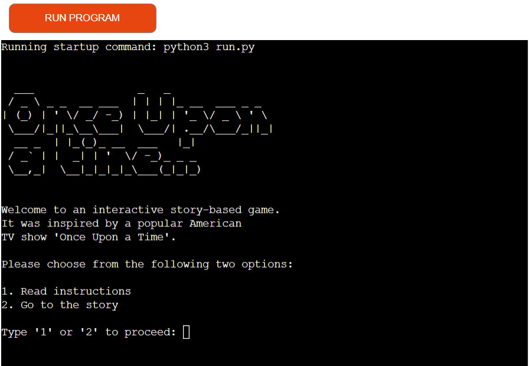

**Instructions**
- The instruction page displays another Ascii art logo "How to play" that clearly indicates to the user where they are in the application.
    - The page lists the steps of how to play the game, and asks the user if they want to play the game or quit the application.

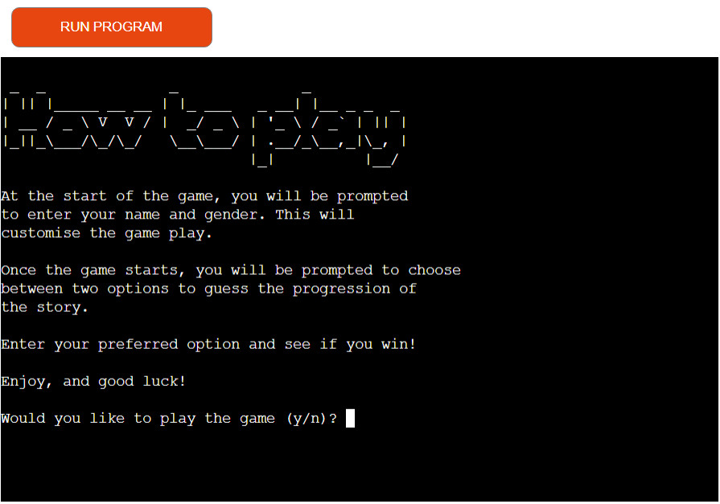

**Game exit**
- If the user chooses to leave the game after reading the instructions, the screen displays "Thank you for playing! see you next time." 
    - The user needs to click on the "Run program" button at the top if they wish to reload the program.

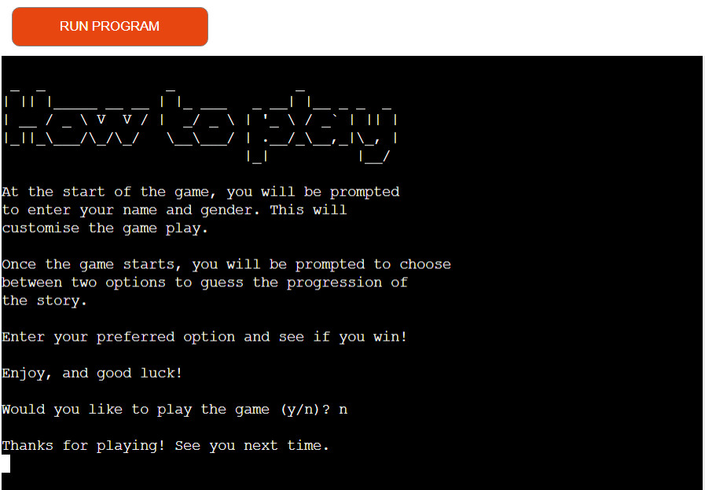

**User data input**

- If the user chooses to proceed to the gameplay, they are prompted to enter their name and gender. 
- By providing this information the game customises the game play, which makes the game more relatable and interactive.
    - The username is visible within the introduction of the storyline and at the end of the game if the user wins the game. 
**To note**: the gender input is not implemented in the current MVP product. 
    - The gender input is set to customise pronouns that will be adjusted at the next stage of the project development.  

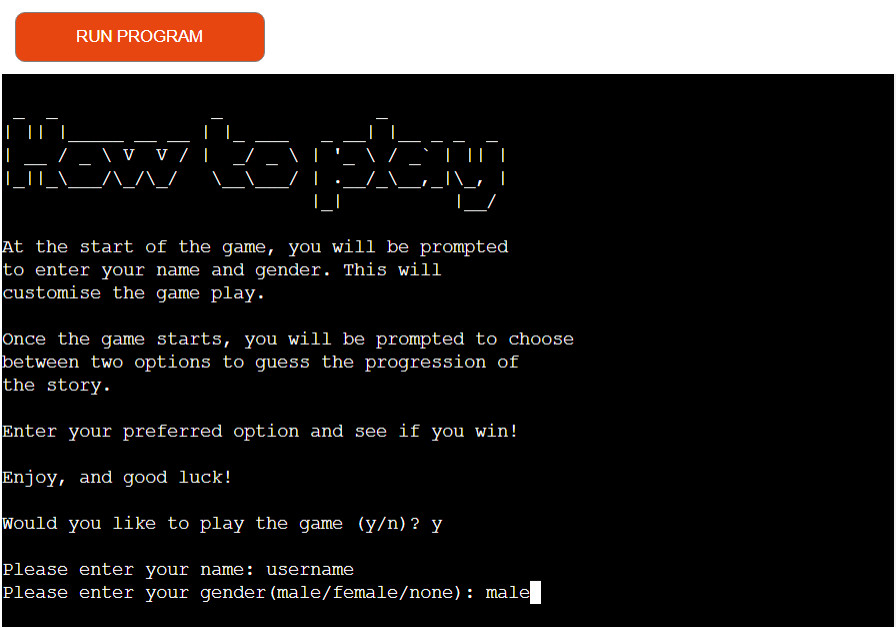

**Story introduction**
- Once the user data is captured, the screen clears the previous content, and loads the main logo together with the beginning of the story. 
    - The user will see that their provided username is generated within the storyline at the end of the first introduction paragraph. 

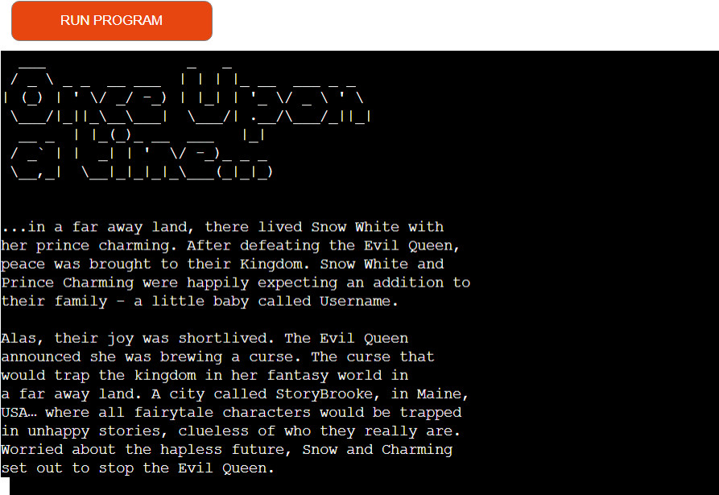

**Chapter 1**
- Chapter 1 section loads straight after the story introduction. 
- The logo provides a clear indication which area within the game play the user is at. 
- Here the user is prompted to choose between two possible outcomes to proceed with the gameplay. 

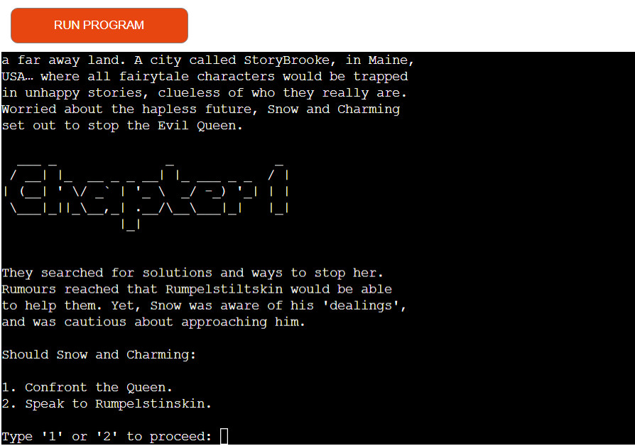

**Chapter 2**
- If the user is successful and progresses to Chapter 2, the screen will, like in Chapter 1, load the logo clearly indicating the progression to the next stage.
- This section of the game provides a few more scenarios, which will take the user to the end of the game, if the user's answers are correct. 

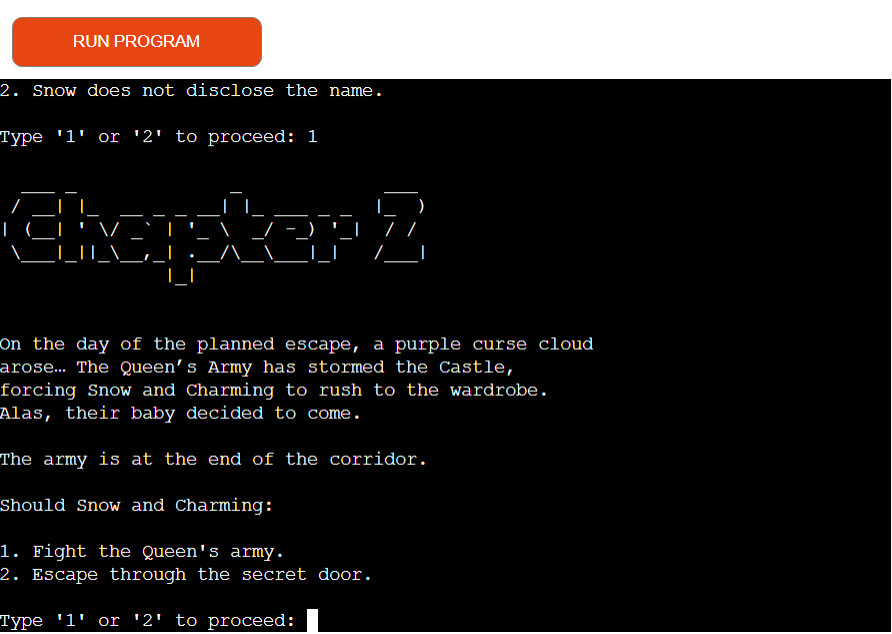

**Winning section**
- Once the user won, the winning paragraph will appear after a small pause. 
- The question asking the user if they wish to proceed to Chapter 3 or terminate the game will generate. 
    - upon selection the terminal will display appropriate message to the user. 
    

    
Winning content screenshot

    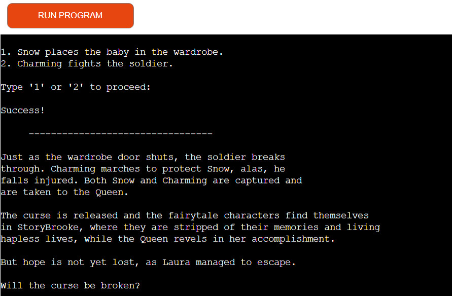
    

    

    
Goodbye message screenshot

    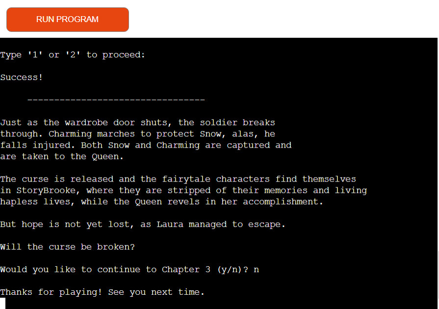
    

    

    
Chapter 3 message screenshot

    
    

**Game progression**
- Throughout the gameplay, each stage of the story is indicated by the question prompt. 
- Alternatively, the story progression, dependent on the user's selection, is clearly indicated by the line breaks that allow the user to follow the content intuitively. 
    - (the answers were deliberately removed from the below screenshots).

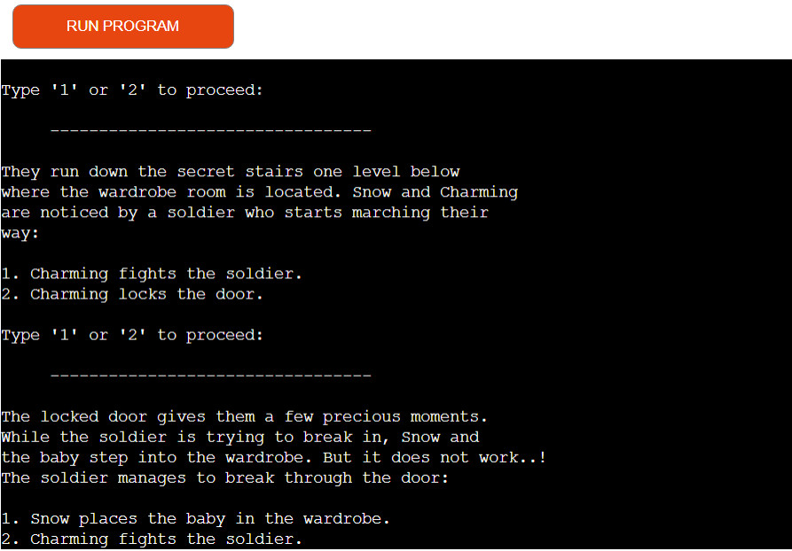

**Incorrect choice**
- If the user selects incorrect answer at any point during the gameplay, a relevant text prints after a few moments, and indicates that the user's choice was incorrect.
- After a few seconds, the screen will automatically return to the main Welcome page, where the user will be able to restart the program again. 

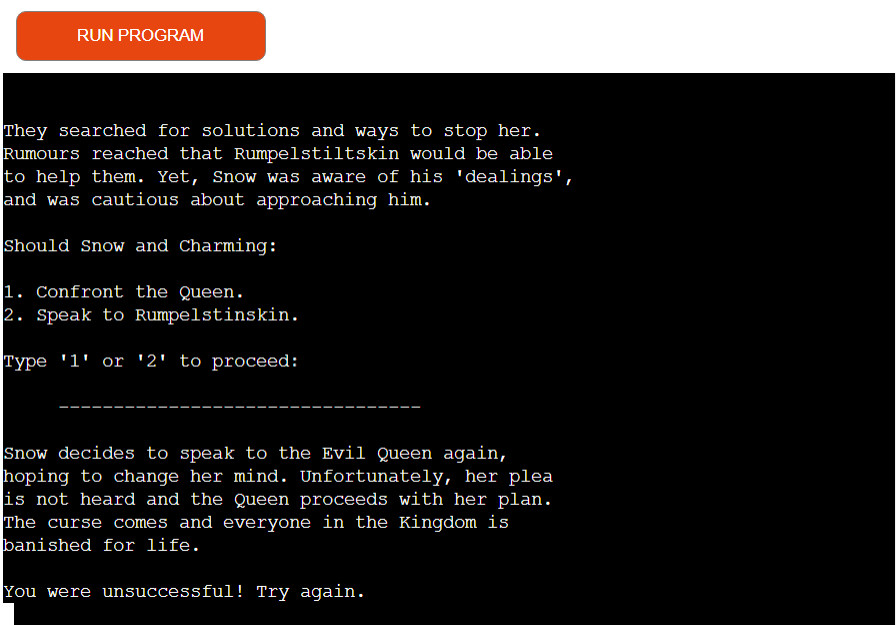

**Time progression**
- To ensure better user experience, the game has a time lag installed. This allows the game to load the content in stages, and ensures a better flow and readability. 
 
**Clearing the screen**
- Similarly to the above point, all the content that proceeds the gameplay is cleared from the screen. This allows better flow of the program in the terminal window.
    - This feature is only applied to the Welcome and the Instruction sections. 
    - Once inside the gameplay, the user will be able to scroll back up to previous storyline content.

### Features Left to Implement

- The current gameplay set up only covers the first part of the pilot episode. Therefore, the next feature will be implementing the second half of the game-play. The flowchart with a breakdown of steps is shown in the [flowcharts](#flowcharts) section.
- The next stage will customise the pronouns in the game text based on the gender data provided by the user at the start of the game.
- Similarly, there is potential to implement the user's age to further customise the story-telling of the game.

These features would allow to make the game more relatable and enjoyable for the user. 

[Return to Table of Contents](#table-of-contents)

## Tools and Technologies
### Languages Used

- The primary language used for developing this project was Python.
- Markdown was used for creating the README and TESTING files.

### Frameworks, Libraries and Programs Used

The following resources were used to help implement the website:
- [Lucidchart](https://lucid.app/) for creating flowchart of the game.
- [GitHub](https://github.com/) for creating and storing files and folders of the website.
- **Git** was used for version control.
- **VScode** editor for writing the code.
- [CI Python Linter](https://pep8ci.herokuapp.com/#) for validating and checking my code for best code practices.
- [Heroku](https://www.heroku.com) for accessing and storing my application game.
- I used the following libraries for the project:
    - **gspread** allowed to access, edit and manipulate data stored in the Google worksheets.  
    - **google.oauth2.service_account** allowed to set up the authentication needed to access my GOOGLE cloud project.
    - **time** module's sleep function allowed to manipulate the timeframe when to display the game content. 
    - **os** library system method allowed to clear the screen for better user experience when displaying the game.

 [Return to Table of Contents](#table-of-contents)

## Testing

The game application went through extensive testing during the development and deployement stages. 
- See [testing.md](TESTING.md) file for full testing and validation information.

[Return to Table of Contents](#table-of-contents)

## Deployment
This website was deployed using GitHub pages and Heroku website. To deploy the project, follow the steps below:

### Github
1. Login to GitHub and navigate to the main repository page.
2.  Click on the chosen repository [Once-Upon-A-Time](https://github.com/laurakond/Once-Upon-a-Time).
3. Once inside the repository, click on the "Settings" tab above the repository title displayed around the middle of the page.
4. Select "Pages" tab on the left side navigation menu.
5. In the "Source" section (middle of the screen), select "main" or "master" branch, then "root" folder and click "save" button.
6. The GitHub page site will be deployed.

It might take a few minutes to generate the "live" website link.

The live link to the game can be found [Once-Upon-A-Time](https://once-upon-a-time-f214671524cd.herokuapp.com/).

#### How to Fork
To fork the repository in Github:
1. Follow steps 1 & 2 as above. 
2. Once inside the chosen repository, click the "fork" button in the top right corner above the "About section".

#### How to Clone
To clone the repository in Github:
1.  Follow steps 1 & 2 as in the deployment section above.
2.  Click on the "Code" button (often a bright color that stands out) in the top right corner just above the "commits" history. 
    - Select whether you would like to clone with HTTPS, SSH or GitHub CLI and copy the link shown.
3.  Open the terminal in your chosen code editor and change the current working directory to the location you want to use for the cloned directory.
4.  Type 'git clone' into the terminal and then paste the copied link and press enter.

### Heroku
To deploy to the Heroku website, follow the steps below:
1. Navigate to https://www.heroku.com platform website.
2. Create or log in to your account.
3. Once on your dashboard:
    1) if you don't have any projects created yet, there should be a "Create a new app" prompt in the middle of the screen.
    2) if you have some projects already, click on the "New" tab on the top right corner of the screen just below the profile bauble. 
4.  Enter a unique application name for your project and select the region you are based in. Click "create app".
5. Once insde the app, select "Settings" button from the menu in the middle. It's important to edit the "Settings" tab before deploying the project: 
    1. Click on "Reveal Config Vars" and enter the following:
        
        1) if you are using any APIs you will need to copy paste your creds.json details:
            - in the "key" box type "CREDS". 
            - in the "value" box copy the contents of your creds.json file: 
            - click "Add".

        2) type in PORT to the "key" box, and 8000 to the "value" box:
            - click "Add".

    2. Add Buildpacks below Config Vars. Click on "Add buildpack":

        1) First, select Python and click "Add buildpack".
        2) Second, select node.js and click "Add buildpack".
        
        **Note:** Python has to be listed first (at the top) of the two packs.
6. Once step 5 is done, navigate to the "Deploy" tab a the top of the screen to the left of where the Settings tab is located.
7. Click on "Github" icon under "Deployment method", and connect Heroku to your Github account. 
8. Once the accounts are connected you can choose between automatic or manual deployment:

    1) Automatic deplyoment will automatically update your app once you use "git push" command in  your IDE. 

    2) Manual deployment will require you to manually "push" the changes you made in the IDE to the Heroku system.

[Return to Table of Contents](#table-of-contents)

## Credits

### Content
The text content for the gameplay was primarily written by me. 

I used Once Upon a Time [Wikipedia](https://en.wikipedia.org/wiki/Pilot_(Once_Upon_a_Time)) page for reference and for creating the future feature (Chapter 3) content. 

### Ascii art
I used [patorjk](https://patorjk.com/software/taag/#p=display&f=Graffiti&t=Type%20Something%20) website for generating game logos. The credit line is also noted in the code.

I referred to the following discussion forum and a video to help me implement Ascii art correctly:
- [Stackoverflow](https://stackoverflow.com/questions/23623288/print-full-ascii-art) discussion thread.
- [The Grimes Teacher](https://www.youtube.com/watch?v=arcFqEuV_XQ) video content on how to print ascii art. 

### Refactoring
The following resources helped to understand and implement the best coding/refactoring practices:
- [FreeCodeCamp](https://www.freecodecamp.org/news/best-practices-for-refactoring-code/) article game me an idea on how to refactor prompt_yes_no_question() function and apply it more than once in the code.
- The following [discussion board](https://discuss.python.org/t/struggling-with-while-loops/20865/10) was helpful for refactoring if statements in the user input/validation functions, more specifically, for using "**not in [list]**" statement. 

### General resources:
I used the following resources to better my understanding on various topics and how to apply specific functionality to my code:
- Data validation:
    - W3Schools:
        - [try/except](https://www.w3schools.com/python/python_try_except.asp)
        - string [is numeric](https://www.w3schools.com/python/ref_string_isnumeric.asp)
        - string [is alpha](https://www.w3schools.com/python/ref_string_isalpha.asp)
        - string [is digit](https://docs.python.org/3/library/stdtypes.html#str.isdigit)
    - Stack overflow forum [thread](https://stackoverflow.com/questions/16399721/making-sure-no-integers-in-a-string) for validating yes/no or '1'/'2' inputs
    - [Fabio Musanni - programming channel](https://www.youtube.com/watch?v=LUWyA3m_-r0) had a good example of try/except use for code validation.

- Dictionary iteration:
    - [Geeks for geeks](https://www.geeksforgeeks.org/python-accessing-items-in-lists-within-dictionary/)
    - [Real Python](https://realpython.com/iterate-through-dictionary-python/
    )

- Time delay for staggering content display:
    - [freeCodeCamp](https://www.freecodecamp.org/news/the-python-sleep-function-how-to-make-python-wait-a-few-seconds-before-continuing-with-example-commands/) article was very useful in understanding how to implement sleep() function to my code.
    - [Dan Leeman](https://www.youtube.com/watch?v=YT2rzhe_dRY) video was a good tool to see sleep() function in action.

- replace() method:
    - [W3Schools](https://www.w3schools.com/python/ref_string_replace.asp) for understanding/reminding myself how to apply it to text manipulation.

- [Medium](https://towardsdatascience.com/common-mistakes-when-dealing-with-multiple-python-files-b4f4dc4d5643) article on how to manage multiple python files.

### Acknowledgments

- My thanks goes to my mentor, [Martina Terlevic](https://github.com/SephTheOverwitch), for providing advice on how to improve my code, giving suggestions how to troubleshoot and providing reassurance when my confidence stumbled.
- Also thank you goes to [Richard Wells](https://github.com/D0nni387) who helped with original project idea development and troubleshooting code errors.
- Thank you to student tutor support for more troubleshooting assistance, and the CI slack community for sharing their experiences, giving advice and suggestions.

### Code Inspiration
- CI Love Sandwiches walkthrough project has provided valuable insight and inspiration on how to start working on the code and what to look out for when creating my Python project. 
    - Credit to the project are also noted within the code.
- Fellow student, Georgina Carlisle's, PP3 work, especially for the idea on how to clear the content.
    - Credit is also noted within the code.

[Return to Table of Contents](#table-of-contents)