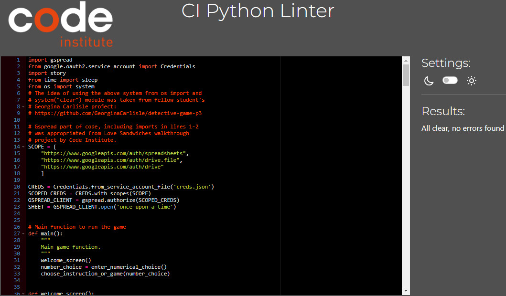
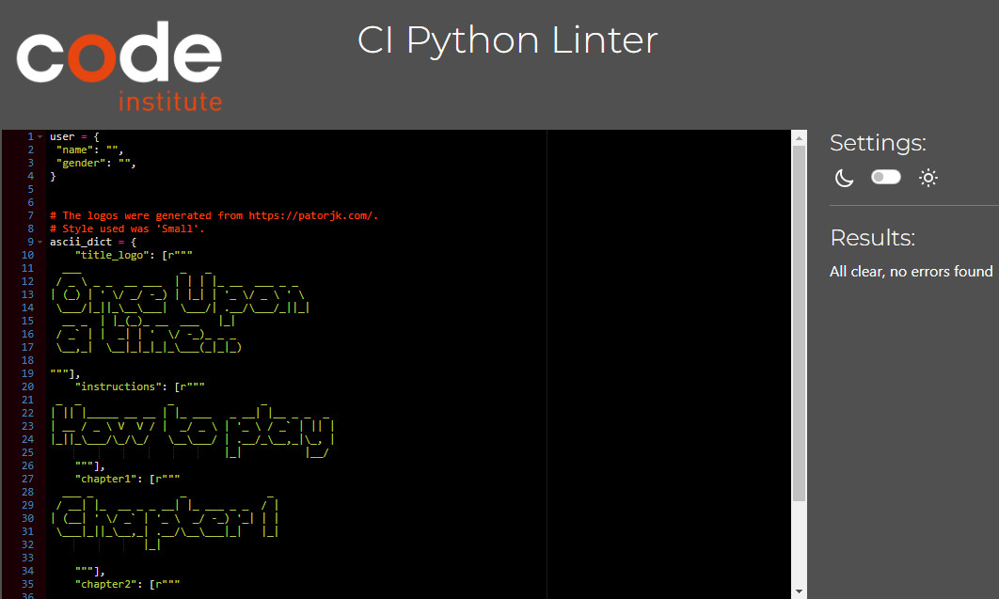
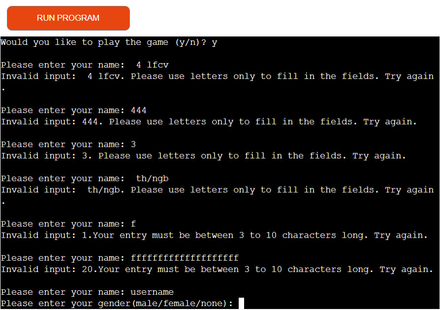
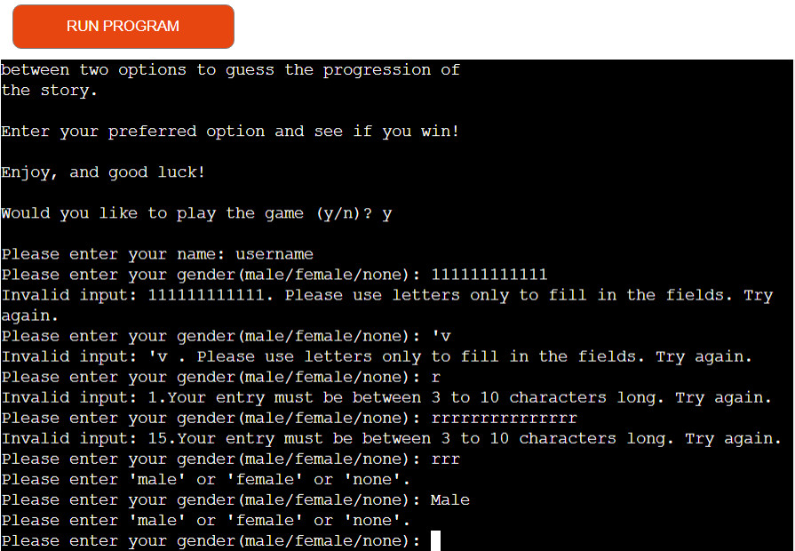
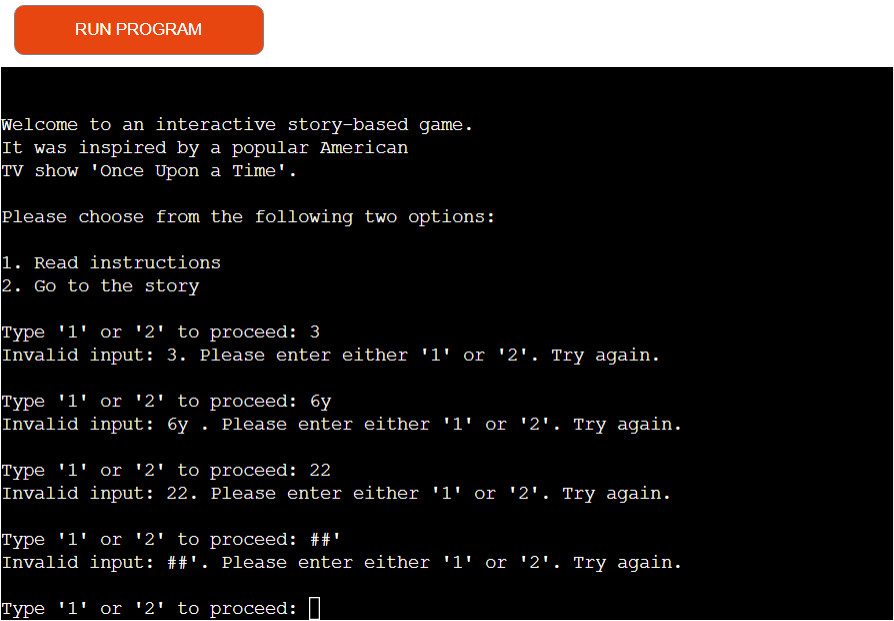
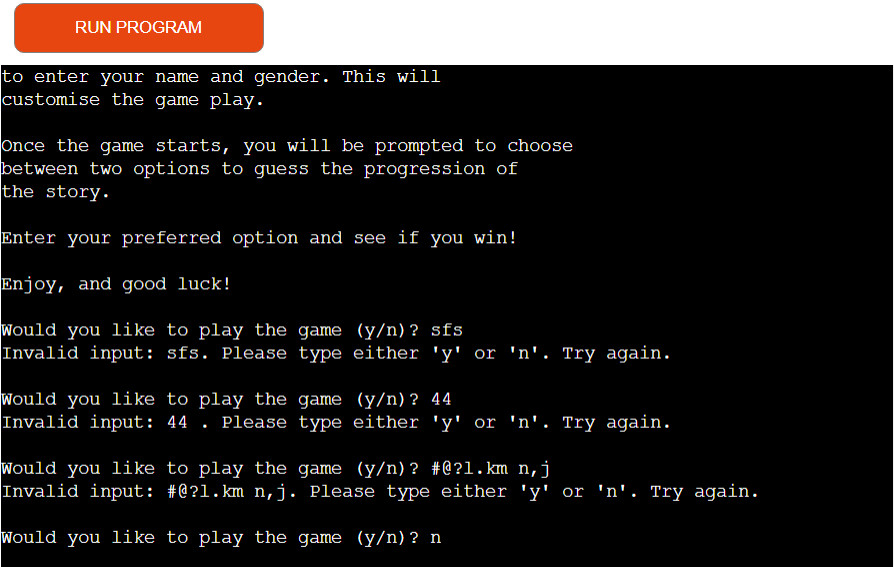
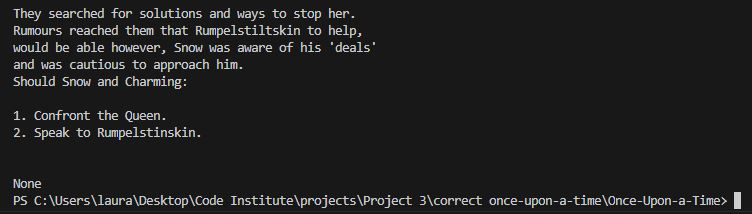
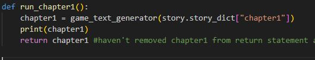

# Testing for Once Upon a Time 
By Laura Kondrataite

## Contents

[Testing](#testing)

- [PEP8 Linter validation](#pep8-linter)
- [User input validation](#user-input-validation)
- [Bugs](#bugs)
	- [Fixed bugs](#fixed-bugs)
	- [Unfixed bugs](#unfixed-bugs)
- [User stories testing](#user-stories-testing)
- [User testing](#user-testing)
- [Manual testing](#manual-testing)

## Testing

### PEP8 Linter validation(#pep8-linter)
I tested the code against the Python linter validator throughout the development stage of the application and once the code was finalised. The final results for both, run.py and story.py, were returned without any errors as per images below:

- run.py

- story.py

[Return to Contents](#contents)

### User input validation

There are several user inputs throughout the application, therefore, validating the provided data was crucial for the functionality of the application. 
- Each part of user input was tested during and after the development stage.
- The below screenshots display all viable entries and responses to incorrect data.

    

    
Username input validation

    
    

    

    
Gender input validation

    
    

    

    
Numerical input validation

    
    

    

    
Yes/No input validation

    
    

[Return to Contents](#contents)

## Bugs

The below mentioned bugs occured early in the development stage before refactoring was done. Therefore, some of the function names and provided images do not correspond to the final code.

### Fixed bugs

**Input validation**
- When working on user input data validation, I had to include an additional if-clause for the gender data in order to validate specific words that the user required to enter. 
    - To make it work, I had to change "or" to "and" statement, otherwise the code was continuously looping regardless if the correct input was provided.

- Function def game_text_generator(data), was throwing a result "None" when the following code was used:

        for line in data:
    	print(line)

    - I resolved this by adding a new variable "text" and assigned an empty list to it. I then looped through each string in the list and appended to the text variable.
        - The terminal then started returning each line without starting them on a new line. I resolved this by adding "\n" at the end of each line within the list in the story.py file.

**None error**
- At the beginning of run_chapter1()(now execute_chapter1()) implementation, the code was producing "None" output when executing the application. This occurred because I used a print() statement inside the run_chapter1() instead of the return statement. 

-   I resolved this by replacing the print() statement with the return statement. 
    

- This error occurred because I confused the functionality of the return statement with the print statement. This was resolved once I implemented the following code inside run_chapter1() function. 

**Text content display**
- I had difficulty making the code generate appropriate text content and functionality. I realised that there was an error in proceed_go_game() function as it collated two separate steps into one. Therefore, I decided to separate it into two functions, one responsible just for generating the user input and validating it using validation function. The other function, continue_to_play(data), I used to generate appropriate content based on user selection in the previous function.
    - This part of the code proved challenging as I was still getting unintentional functionality. After trying multiple ways to display the text, I finally managed to get the code working as intended by printing game text. The other function triggered user input in order to progress along the way: 

            def  proceed_to_game():
            """
            This function runs after instructions and asks if the
            user wants to continue to play the game
            """
            while  True:
                question =  input("Would you like to play the game (y/n)? ").lower()
                if yes_no_validation(question):
            break
            return question
            
            
            def  continue_to_play(data):
            """
            generates appropriate game play functions based
            on user choice after reading instructions
            """
            if data =="y":
                user_input()
                print(game_text_generator(story.story_dict["story_intro"]))
                print(game_text_generator(story.story_dict["chapter1"]))
            return path_selector()
            
            elif data =="n":
            return end_game()
            

            def  path_selector():
            """
            generates a question for the user to select relative path
            to progress the game accordingly.
            """
            while  True:
                first_question =  input("Type '1' or '2' to make a choice: ")
                if option_choice_validation(first_question)
                break
            return test(first_question)

        - At this stage the game functionality seemed to work. 

**Continue to chapter 3**
- At the end of the game, the question "Would you like to continue to Chapter 3 (y/n)?" displayed twice if option "n" was selected. 
    - I resolved this by putting user_input_chpt3 into a variable and using it in the if statement inside continue_chapter3() function.

**Restarting the game**
- When trying to implement the game restart once the end_game() function was triggered, it threw an error: 
"NameError: name 'main' is not defined. Did you mean: 'min'?". 
    - This was because the main() function was defined at the bottom of the code, i.e. after it was called in the game, inside end_game() function.
    - I resolved this by moving the main() function to the top of the code, and calling it inside the end_game() function.

**Updating text content with user_data**
- In order to keep the main run.py file more readable, I decided to store the game text in the story.py file. I applied an f-string to the parts of the text that I needed to update with user-provided data. This proved to be a big challenge as I could not make the text update. There were a few reasons:
    - I realised that the returned user data from user_input() (now called input_user_data()) function was kept in the main run.py file within user{} dictionary.
        - I tried to import run.py file to story.py file, however, I then received a circular import error message. 
        - I resolved this by moving user{} dictionary where the provided data was kept inside the story.py file.
        - After some test runs I made sure that the returned data from the user was correctly stored inside the dictionary and returned when called inside the run.py file. 
    - Trying to return the game text with an f-string was throwing an error which I realised was because I was using the f-string in the list incorrectly, so I decided to leave that approach.
        - After some research, I found a solution by applying replace() method to update the text with user provided data. 

**Crashing application**
- During the testing phase with my mentor, it seemed that the user input prompt "Would you like to play the game (y/n)?" crashed the application when a single letter (not y or n) was entered. 
    - I resolved this by addapting the yes/no question validation code to the one I used for validate_enter_numerical_choice() function. 

### Unfixed bugs

- No unfixed bugs were left in the code. 

[Return to Contents](#contents)

## User stories testing

| User Story                                                                                                     | Completed | Action                                                                                                                                             |
| -------------------------------------------------------------------------------------------------------------- | --------- | -------------------------------------------------------------------------------------------------------------------------------------------------- |
| As a first time user, I want to clearly see what the application is about.                                     | Yes       |                                                                                                                                                    |
| As a first time user, I want to be able to read instructions.                                                  | Yes       |                                                                                                                                                    |
| As a first time user, I want to be able to decide whether to proceed with the game after reading instructions. | Yes       |                                                                                                                                                    |
| As a user, I want to be able to skip the instructions and go straight to the game.                             | Yes       |                                                                                                                                                    |
| As a user, I want to see the game customised based on my name and gender.                                      | Yes/No    | This feature has been partially implemented. Customisation of the pronouns based on the supplied gender data within the the game will be addressed at the nex development stage when building Chapter 3. |
| As a user, I want to be able to decide to finish the game once reached a certain stage of the game.            | Yes       |                                                                                                                                                    |
| As a user, I want to be able to proceed to the next stage of the game after the first part is finished.        | Yes       |                                                                                                                                                    |
| As a user, I want to return to the main screen after the game has finished.                                    | Yes       |                                                                                                                                                    |

[Return to Contents](#contents)

### User testing

The game application was tested thoroughly during the development and deployment stages.
- I have enlisted a number of friends and fellow CI students to test for functionality and user experience.
    - Reviews received noted prolonging text display time in certain parts of the application to ensure that the user had enough time to read through the content.    
    - I initially had the contents clear completely after a certain period of time. However, my mentor suggested that I only apply the feature to the beginning of the application, before entering the game content, and let the content of the gameplay scroll once the user has started the game.
        - This ensured that, in case the user was unable to read all the content, they would be able to scroll up the screen and finish reading.    
    - I applied blank lines and a feature break line to indicate where the new content starts once it is loaded.    
        - This provides better user experience, and the text is is easier to follow.

[Return to Contents](#contents)

### Manual testing
After the development stage of the application, I went through each feature/section of the gameplay ensuring that is working as intended.

| Feature                                                    | Test performed                                                                 | Expected outcome                                                                                                                                                                                                                                                                                      | Pass/Fail |
| ---------------------------------------------------------- | ------------------------------------------------------------------------------ | ----------------------------------------------------------------------------------------------------------------------------------------------------------------------------------------------------------------------------------------------------------------------------------------------------- | --------- |
| User input field requiring numerical data entry            | Type in '1' or '2'                                                             | Redirects to the instruction area or the main gameplay.                                                                                                                                                                                                                                               | Pass      |
| User input field requiring yes/no data entry               | Type in 'y' or 'n'                                                             | Calls the program to carry out appropriate action. If the selection was 'n', the program terminates. If the selection was 'y', the program continues. This entry is not case-sensitive.                                                                                                               | Pass      |
| User input field requiring numerical data entry validation | Type in wrong entry where '1' or '2' were the options                          | When any other number, letter, combination of letters, numbers and/or characters are typed, the following message appears: "Invalid input (user's input). Please enter either '1' or '2'. Try again." This line is repeated until the user provides correct entry.                                    | Pass      |
| User input field requiring yes/no data entry validation    | Type in wrong entry where 'y' or 'n' were the options                          | When any other number, letter, combination of letters, numbers and/or characters are typed, the following message appears: "Invalid input (user's input). Please type either 'y' or 'n'. Try again." This line is repeated until the user provides correct entry.                                     | Pass      |
| User input field requiring username                        | Type in the username                                                           | Captures the user's entry and stores for future in-game use as part of game customisation. Provided data's first letter is capitalised if the entry was in small letters. The entry triggers the user's gender input field to show up.                                                                | Pass      |
| User input field requiring username entry validation       | Type in the numerical value in username input field                            | When a number is entered into the username field, the following message appears: "Invalid input (user's input). Please use letters only to fill in the fields. Try again." This line is repeated until the user provides correct entry.                                                               | Pass      |
| User input field requiring username entry validation       | Type in one, two or more than ten letters                                      | When only one, two letters or more than 10 characters are input into the username field, the following message appears: "Invalid input (number of user's input letters). Your entry must be between 3 to 10 characters long. Try again." This line is repeated until the user provides correct entry. | Pass      |
| User input field requiring username entry validation       | Type in a combination of letters, numbers, characters or any of the variations | When a combination of letters/numbers/special characters are input into the username field, the following message appears: "Invalid input (user's input). Please use letters only to fill in the fields. Try again." This line is repeated until the user provides correct entry.                     | Pass      |
| User input field requiring user gender entry validation    | Type in the gender                                                             | Captures the user's entry and stores for future in-game use as part of game customisation. This feature is not implemented in the MVP. This entry is caps lock sensitive. This entry triggers the gameplay. Previous data is cleared and the story section is loaded.                                 | Pass      |
| User input field requiring user gender entry validation    | Type in numerical value in gender input field                                  | When a number is entered into the gender input field, the following message appears: "Invalid input (user's input). Please use letters only to fill in the fields. Try again." This line is repeated until the user provides correct entry.                                                           | Pass      |
| User input field requiring user gender entry validation    | Type in any letter combination                                                 | When any letter combination or word  are input into the gender input field, the following message appears: "Please enter 'male', 'female' or 'none'." This line is repeated until the user provides correct entry.                                                                                    | Pass      |
| User input field requiring user gender entry validation    | Type in a combination of letters, numbers, characters or any of the variations | When a combination of letters/numbers/special characters are input into the user gender field, the following message appears: "Invalid input (user's input). Please use letters only to fill in the fields. Try again." This line is repeated until the user provides correct entry.                  | Pass      |
| Select the wrong possible scenario                         | Type in the incorrect option number                                            | A screen divider appears, signaling story progression. Appropriate story continuation appears, followed by "You were unsuccessful! Try again." line. After 5 seconds, the screen will clear and the user is taken back to the beginning of the application.                                           | Pass      |
| Select the right scenario                                  | Type in the correct option number                                              | A screen divider or an ascii art logo appears, signaling story progression. After a short pause appropriate story continuation appears, followed by the next scenario choice.                                                                                                                         | Pass      |
| Winning scenario choice                                    | Select the last correct scenario option                                        | The winning sentence 'Success!' appears. A line divider appears, followed by the final story continuation. The last question asking the user if they want to continue to Chapter 3 appears.                                                                                                           | Pass      |
| User input field requiring y/n input                       | Type in 'y'                                                                    | The user is shown a 'Coming soon - stay tuned, Deary!' line followed by a goodbye message. This terminates the game.                                                                                                                                                                                  | Pass      |
| User input field requiring y/n input                       | Type in 'n'                                                                    | A goodbye message message is displayed to the user. This terminates the game.                                                                                                                                                                                                                         | Pass      |

[Return to Table of Contents](#contents)

[Return to the main README.md](README.md)